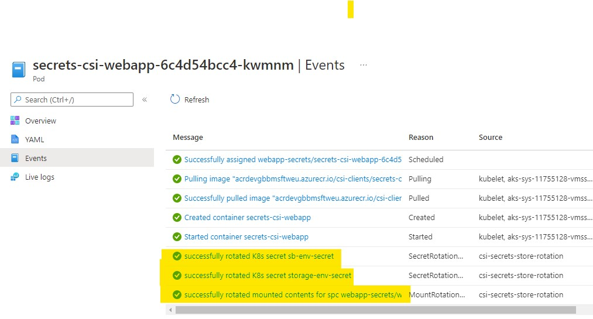
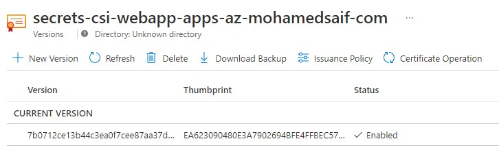

# Azure Key Vault Secret CSI Store

Reference implementation of Azure Key Vault secret store CSI driver

## Overview

Using Azure Key Vault secret store CSI driver on AKS requires planning and implementation details to optimize the use of it.

It is worth mentioning that AKV CSI driver support both Linux and Windows nodes which make it an appealing option for unified secret access across platforms.

Things to consider:

### Planning your key vault approach

There is no single right way to use Azure Key Vault to manage your secrets, but you give an idea of the approach, you might consider the following:

#### Central Key Vault

Used to store secrets that are managed by central team.

One example would be using it to store the TLS certificates that are issued and managed by central security team.

#### Project Key Vault

Used to store project specific secrets that are managed by the service/project team.

Examples may include service bus connection string, database credentials and other secrets that are directly connected to specific project and the responsibility for maintaining these secrets reside with the service/project team.

#### User Assigned Managed Identity

Although you can get a default user assigned identity when you enable the CSI driver via AKS Add-On, I'm not recommending relying on this identity to grant access to Key Vault(s).

My recommendation is to create ahead of time a dedicated managed identity to be used by your cluster to access target Key Vault.

If you are mixing different Key Vaults, I would recommend different identities for each unless you have a reason to have only one (there are good reasons for both approaches).

### Understand CSI specs

It is important to understand the different capabilities and deployment options for the AKV CSI driver in order to maximize the utilization.

I would highly recommend to take your time reviewing the following documentations:

1. [AKV Secret Store CSI Driver Docs](https://azure.github.io/secrets-store-csi-driver-provider-azure/docs/)
2. [Secret Store CSI Driver Specs](https://secrets-store-csi-driver.sigs.k8s.io/introduction.html)

### Reference implementation application

I've created a sample ASP .NET web application to demonstrate accessing the secrets.

As there are many ways to push the application image to ACR, I'm using here Azure CLI approach for simplicity:

```bash

# make sure you are running these commands in the context of the source code folder
cd src/SecretsCSIWebApp

# Azure Container Registry name
ACR_NAME=REPLACE

# Make sure that the bash command line folder context set to the root where dockerfile exists

# OPTION 1: Using ACR Tasks
# With dynamic version
az acr build -t csi-clients/secrets-csi-webapp:{{.Run.ID}} -t csi-clients/secrets-csi-webapp:latest -r $ACR_NAME .

```

By a quick look at [Index.cshtml.cs](src/SecretsCSIWebApp/Pages/Index.cshtml.cs), you will find secrets reading logic:

```csharp

public void OnGet()
{
    //ViewBag.Message = "System version 1";
    string sbKey = Environment.GetEnvironmentVariable("sb-env-secret") ?? "NA";
    string storageKey = Environment.GetEnvironmentVariable("storage-env-secret") ?? "NA";
    string sbKeyFile = "NA";
    string secretsFolder = Path.Combine(hostEnvironment.WebRootPath, "secrets");
    string sbSecretFile = Path.Combine(secretsFolder, "servicebus-key");
    if (System.IO.File.Exists(sbSecretFile))
        sbKeyFile = System.IO.File.ReadAllText(sbSecretFile);

    StorageConnection = storageKey;
    SBConnection = sbKey;
    MountData = $"Secret found at ({sbSecretFile}): {sbKeyFile}";
}

```

As you can see from the code, I'm trying to read the following:
- From environment variables synced k8s secrets for ```sbKey``` and ```storageKey```
- From mounted volume [../secrets/servicebus-key]

My objective hear to show that environment based secrets will not be rotated unless the pod restart while mounted volume secrets can be rotated without restart (implementing some volume watcher logic can pick the new secret when updated).

### Azure deployments

I'm assuming already you have already provisioned:
- AKS cluster
- Azure Key Vault
- User Assigned Managed Identity

If you need to provision these resources please go ahead and do so and make sure the AKS context is set in your local development environment.

### AKS

Now if you are using an existing AKS cluster, we need to make sure that AKV Secrets Store CSI driver is enabled with all required configuration:

There is 2 options to use the AKV CSI driver: via AKS CSI add-on or via manual installation via helm.

Let's find first if you have it on the cluster:

```bash

# Validate the CSI is installed (for Add-On installation)
kubectl get pods -n kube-system -l 'app in (secrets-store-csi-driver, secrets-store-provider-azure)'
# NAME                                     READY   STATUS    RESTARTS   AGE
# aks-secrets-store-csi-driver-dvhb4       3/3     Running   0          3d23h
# aks-secrets-store-csi-driver-w2vxj       3/3     Running   0          4d4h
# aks-secrets-store-csi-driver-wjms7       3/3     Running   0          4d4h
# aks-secrets-store-provider-azure-hvkvx   1/1     Running   0          6d
# aks-secrets-store-provider-azure-v8bsk   1/1     Running   0          3d23h
# aks-secrets-store-provider-azure-vp4pf   1/1     Running   0          6d

# Validate the CSI is installed (for Helm)
kubectl get pods -l app=csi-secrets-store -n kube-system

# If you got no resources, then you probably needs to install it.

```

Let's check the different approaches to install the AKV CSI driver.

#### Installing AKV CSI via AKS Add-On

>**NOTE:** As of this commit, I've detected an issue with auto-rotation of secrets using CSI with AKS add-on experience. If auto-rotation is critical to your implementation, I would recommend using the helm installation instead until this issue is resolved.

Although you can enable it via Azure Portal, I highly recommend enabling it via CLI to ensure all required configuration exists:

```bash 
# Making sure that secret auto rotation is enabled with 2 mins rotation period
AKS_NAME=REPLACE
AKS_RG=REPLACE
az aks enable-addons \
  --name $AKS_NAME \
  --resource-group $AKS_RG \
  --addons azure-keyvault-secrets-provider \
  --enable-secret-rotation \
  --rotation-poll-interval 2m

# Check that the add-on is enabled and with what configurations (it should be enabled with auto-rotation):
az aks show -g $AKS_RG -n $AKS_NAME --query 'addonProfiles.azureKeyvaultSecretsProvider'
# {
#   "config": {
#     "enableSecretRotation": "true",
#     "rotationPollInterval": "2m"
#   },
#   "enabled": true,
#   "identity": {
#     "clientId": "GUID",
#     "objectId": "GUID",
#     "resourceId": "/subscriptions/SUBSCRIPTION/resourcegroups/MC_RG/providers/Microsoft.ManagedIdentity/userAssignedIdentities/azurekeyvaultsecretsprovider-CLUSTER-NAME"
#   }
# }

# Validate
kubectl get pods -n kube-system -l 'app in (secrets-store-csi-driver, secrets-store-provider-azure)'


# NOTE:
# If you face later any issues, try to disable and re-enable it:
# az aks disable-addons --addons azure-keyvault-secrets-provider -g $AKS_RG -n $AKS_NAME


```

#### Installing AKV CSI via Helm (manual)

Manual installation of the AKV Secrets CSI can be accomplished via helm:

```bash

helm repo add csi-secrets-store-provider-azure https://azure.github.io/secrets-store-csi-driver-provider-azure/charts
helm repo update
helm upgrade --install csi csi-secrets-store-provider-azure/csi-secrets-store-provider-azure --namespace kube-system \
  --set secrets-store-csi-driver.enableSecretRotation=true \
  --set secrets-store-csi-driver.rotationPollInterval=2m \
  --set secrets-store-csi-driver.syncSecret.enabled=true

# Validate
kubectl get pods -l app=csi-secrets-store -n kube-system

```

#### Azure Key Vault

Now, we need to create 2 secrets in Azure Key Vault as the following:

- servicebus-key
- storage-key

Just add random values to these secrets but make sure they are recognizable by you.

Next we need to give **Get** access policy for **Key Permissions, Secret Permissions and Certificate Permissions** to the newly created User Assigned Managed Identity.

This can be accomplished via going to **Access policies** under your Key Vault and select **Add Access Policy**

### User Assigned Managed Identity

You also need to attach the User Assigned Identity that you will be using to the AKS VMSS under the **MC_** resource group.

This can be accomplished by going the your AKS node pool VMSS under the infra resource group and select Identity -> User Assigned (you should find couple other already associated identities)


>NOTE: In this sample, I opted to use the same user assigned managed identity and key vault to store the TLS certificate, but in production scenarios you might consider using a separate (like central) key vault with its user assigned identity to retrieve the TLS cert.

### Deployment to AKS

Browse to the [src/SecretsCSIWebApp/k8s](src/SecretsCSIWebApp/k8s/) and update all files with your environment variables:

Things to replace in the deployment files:
- **webapp-secrets-spc.yaml**: userAssignedIdentityID, keyvaultName, tenantId
- **secrets-csi-webapp-deployment.yaml**: image (to point to your ACR)

Once you updated the above files, you are ready to execute the apply commands:

```bash
# Assuming you have a bash terminal on k8s folder, execute the following commands:
kubectl apply -f webapp-secrets-ns.yaml
kubectl apply -f webapp-secrets-spc.yaml
kubectl apply -f secrets-csi-webapp-deployment.yaml
kubectl apply -f secrets-csi-webapp-service.yaml

# Validate
kubectl get pods,secrets,services -n webapp-secrets
# If everything configured correctly, you should get something like:
# NAME                                      READY   STATUS    RESTARTS   AGE
# pod/secrets-csi-webapp-6c4d54bcc4-vf66m   1/1     Running   0          17m

# NAME                         TYPE                                  DATA   AGE
# secret/default-token-86z22   kubernetes.io/service-account-token   3      22m
# secret/sb-env-secret         Opaque                                1      20m
# secret/storage-env-secret    Opaque                                1      20m

# NAME                                 TYPE        CLUSTER-IP    EXTERNAL-IP   PORT(S)   AGE
# service/secrets-csi-webapp-service   ClusterIP   10.0.37.181   <none>        80/TCP    14m

# Access the webapp via a forwarder:
kubectl port-forward -n webapp-secrets service/secrets-csi-webapp-service 8080:80

# Browse to http://localhost:8080 and validate that all secrets are read successfully (both from ENV and mount)

```

When you open the app in the browser, you should be able to see secret values from both environment variables (via secrets sync feature) and via secret volume mount.


If you wish to to update the secret in AKV, then wait for at least 2 mins, you should see the secret rotated with the new values:


>NOTE: Only the app was able to get the updated value from the mount while the synced secret as environment variable remained with its initial value which is expected as environment variables will only set during initialization of the pod (even if the underlying secret is updated).

Also if you check the pod's Kubernetes events, you should see rotation events:



### Ingress TLS

In order to demonstrate using the secret store CSI driver with TLS, I'm using nginx ingress controller as the k8s ingress implementation, although same concepts might very well apply with other ingress implementations.

For the sake of completeness, I will demonstrate end-to-end implementation approach that consist of:
- Creating self-signed TLS certificate (with custom private domain)
- Deploying nginx ingress controller (via helm)
- Deploying the ingress for **secrets-csi-webapp-service** and updating the webapp deployment with the TLS secret

#### TLS self-signed cert

Here I'm generating a self-signed cert using ```openssl```:

```bash

# Preparing TLS certs
CERT_NAME=secrets-csi-webapp-apps-az-mohamedsaif-com
CERT_CN=secrets-csi-webapp.apps.az.mohamedsaif.com

AKV_NAME=aks-weu-kv

mkdir certs
openssl req -x509 -nodes -days 365 -newkey rsa:2048 \
    -out certs/$CERT_NAME-tls.crt \
    -keyout certs/$CERT_NAME-tls.key \
    -subj "/CN=$CERT_CN/O=$CERT_CN"

openssl pkcs12 -export -in certs/$CERT_NAME-tls.crt -inkey certs/$CERT_NAME-tls.key  -out certs/$CERT_NAME.pfx
# skip Password prompt to have empty password pfx

# import the certificate to key vault
az keyvault certificate import --vault-name $AKV_NAME -n $CERT_NAME -f certs/$CERT_NAME.pfx

# Validate certificate files
openssl x509 -in certs/$CERT_NAME-tls.crt -text -noout

```

By checking out the key vault on Azure Portal, you should find the new certificate:



#### Installing nginx ingress controller

I've opted to install the ingress controller with a private load balancer, which is a common practice in production systems (avoid exposing public services directly from AKS)

```bash

helm repo add ingress-nginx https://kubernetes.github.io/ingress-nginx
helm repo update
kubectl create namespace nginx

# This installation assumes that the application would be a different namespace from the ingress controller and it will have the TLS secret:
helm upgrade --install nginx-ingress ingress-nginx/ingress-nginx \
    --namespace nginx \
    --set controller.replicaCount=1 \
    --set controller.nodeSelector."beta\.kubernetes\.io/os"=linux \
    --set defaultBackend.nodeSelector."beta\.kubernetes\.io/os"=linux \
    -f - <<EOF
controller:
  service:
    type: LoadBalancer
    annotations:
      service.beta.kubernetes.io/azure-load-balancer-internal: "true"
EOF

```

#### Deploying the ingress

Now it is time to deploy our ingress

For the scenario to work, we need:
- Deploy the new secret provider class the holds the TLS secret to the application namespace
- Update our webapp deployment to mount the TLS secret (as the ingress and k8s TLS secret are scoped to a namespace which is the application namespace in this case)
- Deploy the ingress in the application namespace

Before applying the deployment files, please update the following:
- **ingress-tls-spc.yaml**: $CERT_NAME (in several locations), userAssignedIdentityID, keyvaultName, tenantId
- **secrets-csi-webapp-tls-deployment.yaml**: image (to point to your ACR)

```bash

kubectl apply -f ingress-tls-spc.yaml
kubectl apply -f secrets-csi-webapp-tls-deployment.yaml
kubectl apply -f ingress.yaml

# Validate
kubectl get pods,secrets,ingress -n webapp-secrets
# NAME                                     READY   STATUS    RESTARTS   AGE
# pod/secrets-csi-webapp-dc89d9749-qtczz   1/1     Running   0          7m51s

# # NAME                         TYPE                                  DATA   AGE
# secret/default-token-wj842   kubernetes.io/service-account-token   3      47h
# secret/ingress-tls-csi       kubernetes.io/tls                     2      21m
# secret/sb-env-secret         Opaque                                1      46h
# secret/storage-env-secret    Opaque                                1      46h

# NAME                                       CLASS    HOSTS                                           ADDRESS       PORTS     AGE
# ingress.networking.k8s.io/webapp-ingress   <none>   my.secrets-csi-webapp.apps.az.mohamedsaif.com   10.171.0.66   80, 443   76s

# Test the access
kubectl port-forward -n nginx service/nginx-ingress-ingress-nginx-controller 8433:443
echo https://my.$CERT_CN:8433
curl -v -k --resolve my.$CERT_CN:8433:127.0.0.1 https://my.$CERT_CN:8433

```

## Diagnosis

Below are few commands that are helpful in debugging issues:

```bash
# if installed via AKS add-on
kubectl get pods -n kube-system -l 'app in (secrets-store-csi-driver, secrets-store-provider-azure)' -o wide

# if installed via helm
kubectl get pods -n kube-system -l app=csi-secrets-store-provider-azure -o wide

# Check which node the webapp pod is running
kubectl get pods -n webapp-secrets -o wide

kubectl logs -n kube-system <provider pod name on the same node> --since=1h

# examples
# kubectl logs -n kube-system aks-secrets-store-provider-azure-v4z4w --since=1h | grep ^E
# kubectl logs -n kube-system aks-secrets-store-provider-azure-w5v62 --since=1h | grep ^E
# kubectl logs -n kube-system csi-csi-secrets-store-provider-azure-9c6s2 > csi-csi-secrets-store-provider-azure-9c6s2-logs.txt

# Ingress diagnostics
NGINX_CONTROLLER_POD=$(kubectl get pods -n nginx -l app.kubernetes.io/name=ingress-nginx -o jsonpath='{.items[0].metadata.name}')
echo $NGINX_CONTROLLER_POD
kubectl logs -n nginx $NGINX_CONTROLLER_POD -c controller

# If you want to restart the deployment of nginx:
kubectl rollout restart -n nginx deploy/nginx-ingress-ingress-nginx-controller
kubectl get pods -n nginx

```